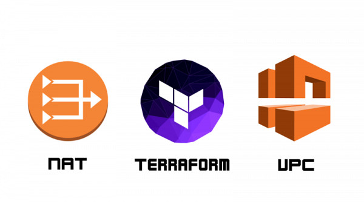
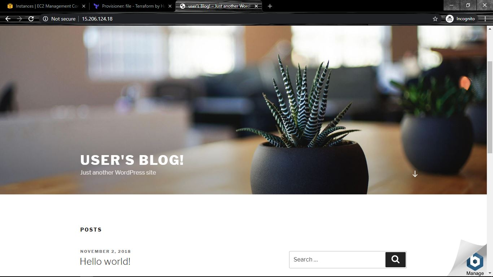

# Secured Web portal with WordPress & MySQL using NAT Gateway  

  

We have to create a web portal for our company with all the security as much as possible. So, we use the WordPress software with a dedicated database server. The database should not be accessible from the outside world for security purposes but can be accessible by only Bastion Host so that it can do all the necessary updates and fix security patches. We only need to make WordPress as public to the clients.  

1. Write an Infrastructure as code using Terraform, which automatically create a VPC.  
2. In that VPC we have to create 2 subnets:  
- public subnet [ Accessible for Public World! ]
- private subnet [ Restricted for Public World! ]
3. Create a public-facing internet gateway for connecting our VPC/Network to the internet world and attach this gateway to our VPC.  
4. Create a routing table for Internet gateway so that instance can connect to the outside world, update and associate it with the public subnet.  
5. Create a NAT gateway to connect our VPC/Network to the internet world and attach this gateway to our VPC in the public network.  
6. Update the routing table of the private subnet, so that to access the internet it uses the nat gateway created in the public subnet.  
7. Launch an EC2 Bastion Host instance through which we can go inside the MySQL instance with security group SSH to do updates and fix security patches. Also, attach the key to the instance for further login into it.  
8. Launch an EC2 instance which has MYSQL setup already with security group allowing port 3306 in a private subnet so that our WordPress VM can connect with the same. Also, attach the key with the same.  
9. Launch an EC2 instance which has WordPress setup already having the security group allowing port 80 so that our client can connect to our WordPress site. Also, attach the key to the instance for further login into it.  

__Note:__  

- WordPress instance has to be part of public subnet so that our client can connect to our site.
- MYSQL instance has to be part of private subnet so that the outside world can’t connect to it.
- Don’t forget to add auto IP assign and auto DNS name assignment option to be enabled.  

### You can view the full implementation on my blog:
https://medium.com/@saurabhagarwal43800/a-secured-web-portal-with-wordpress-mysql-using-nat-gateway-82d1bbde869b  

- terraform init
- terraform apply -auto-approve  

 
